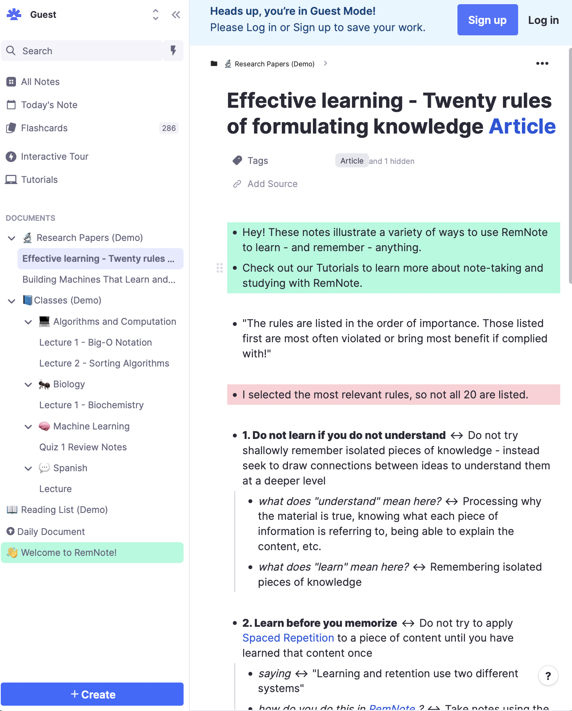

========================
Knowledge Keeping
========================

It's advantageous to have a centralized store of strategies 
and knowledge as it relates to lab specific research tactics 
and methodology. There are a number of benefits to using 
more than a simple file server of Word documents. Ideas can 
be abstracted, linked, tracked, and reformed intuitively. 
Colaboration becomes more fluid, and ideas can be transferred 
accross teams seamlessly.

There are a number of services that offer solutions of various 
flavors, however many of them cost money, come with privacy 
considerations, or require a combination of multiple solutions 
to fit a research lab's specific needs, and may come with 
more managerial overhead than they are worth.

MkDocs
-------
    Provides self-hosted documentation generation, like the page 
    you are reading. 

    Uses the widely-used Markdown format.

    Git-centric: makes contribution seamless and accessible.

    Free/open-source 
(https://docs.readthedocs.io/en/stable/intro/getting-started-with-mkdocs.html)

RemNote
--------
Born from a student design project at MIT, RemNote is 
an "all-in-one tool for thinking and learning", focusing 
on general long-term knowledge management. 

Claims to replace:
-   Microsoft Notes 
-   Microsoft Word 
-   Obsidian
-   Notion 
-   Evernote 

Could be used to formulate, track, and organize ideas as they grow 
from abstract to concrete, or build a lab wiki. Can be contributed to 
by any team members to with little inertia.

Offerings
    Notes, Docs, & Outlines 
        Capture and link ideas
    PDFs & Web Articles
        Easily highlight, reference, and link all of your source 
        material. No application switching 
    

Try It Out:
    https://www.remnote.com/w/guest/FWpu7xxPMSLFTHWRD
